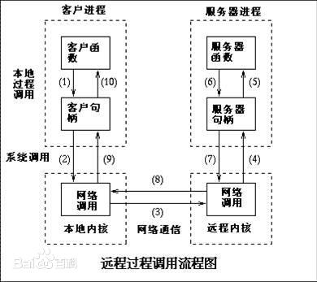

# 基于Netty的RPC框架

[项目介绍](#项目介绍) | [技术架构](#技术架构) | [项目总结](#项目总结) | [使用说明](#使用说明) | [参考资料](#参考资料)

ʕ•̫͡•ʔ-̫͡-ʕ•͓͡•ʕ•̫͡•ʔ-̫͡-ʕ•͓͡•ʔ-̫͡-ʔ

> RPC是远程过程调用（Remote Procedure Call）的缩写形式。SAP系统RPC调用的原理其实很简单，类似于三层构架的C/S系统，第三方的客户程序通过接口调用SAP内部的标准或自定义函数，获得函数返回的数据进行处理后显示或打印。
>
> [](https://baike.baidu.com/item/%E8%BF%9C%E7%A8%8B%E8%BF%87%E7%A8%8B%E8%B0%83%E7%94%A8/7854346)

## 项目介绍

一款基于Netty的RPC框架，使用Zookeeper作为注册中心


服务提供者Server向注册中心注册服务，服务消费者Client通过注册中心拿到服务相关信息，然后再通过网络调用服务提供者

注册中心：负责服务地址的注册与查找，项目使用Zookeeper作为注册中心

网络传输：使用基于NIO的Netty框架

序列化：kryo、protostuff

动态代理：使用了动态代理技术屏蔽了远程调用方法的细节，让我们调用远程方法像调用本地方法一样简单

## 技术架构

- Netty
- Zookeeper
- Spring

## 项目总结

- 使用基于NIO的Netty框架代替BIO实现网络传输
- 使用Zookeeper作为注册中心
- 增加了Netty的心跳机制，保证客户端和服务端的连接不被断掉
- 集成Spring通过注解进行服务注册与消费
- 使用`curator-framework`操作zookeeper
- 自定义了客户端与服务端的通信协议

## 使用说明

#### 服务提供者

实现接口：

```java
@Slf4j
@RpcService(group = "test1", version = "test1")
public class HelloServiceImpl1 implements HelloService {
    static {
        log.info("HelloServiceImpl1被创建");
    }

    @Override
    public String hello(Hello hello) {
        log.info("HelloServiceImpl1收到: {}", hello.getMessage());
        String result = "Hello description is " + hello.getDescription();
        log.info("HelloServiceImpl1返回: {}", result);
        return result;
    }
}
```

```java
@Slf4j
public class HelloServiceImpl2 implements HelloService {
    static {
        log.info("HelloServiceImpl2被创建");
    }

    @Override
    public String hello(Hello hello) {
        log.info("HelloServiceImpl2收到: {}", hello.getMessage());
        String result = "Hello description is " + hello.getDescription();
        log.info("HelloServiceImpl2返回: {}", result);
        return result;
    }
}
```

发布服务：

```java
@RpcScan(basePackage = {"github.lyh2048"})
public class Server {
    public static void main(String[] args) {
        AnnotationConfigApplicationContext applicationContext = new AnnotationConfigApplicationContext(Server.class);
        NettyRpcServer server = (NettyRpcServer) applicationContext.getBean("nettyRpcServer");
        HelloService helloService2 = new HelloServiceImpl2();
        RpcServiceConfig rpcServiceConfig = RpcServiceConfig.builder()
                .group("test2").version("test2").service(helloService2).build();
        server.registerService(rpcServiceConfig);
        server.start();
    }
}
```


#### 服务消费者

```java
@Component
@Slf4j
public class HelloController {

    @RpcReference(version = "test1", group = "test1")
    private HelloService helloService;

    public void test() {
        String hello = helloService.hello(new Hello("666", "999"));
        log.info("result: " + hello);
    }
}
```

```java
@RpcScan(basePackage = {"github.lyh2048"})
public class Client {
    public static void main(String[] args) {
        AnnotationConfigApplicationContext applicationContext = new AnnotationConfigApplicationContext(Client.class);
        HelloController helloController = (HelloController) applicationContext.getBean("helloController");
        helloController.test();
    }
}
```


## 参考资料

[https://github.com/Snailclimb/guide-rpc-framework](https://github.com/Snailclimb/guide-rpc-framework)

[https://dubbo.apache.org/zh/](https://dubbo.apache.org/zh/)

